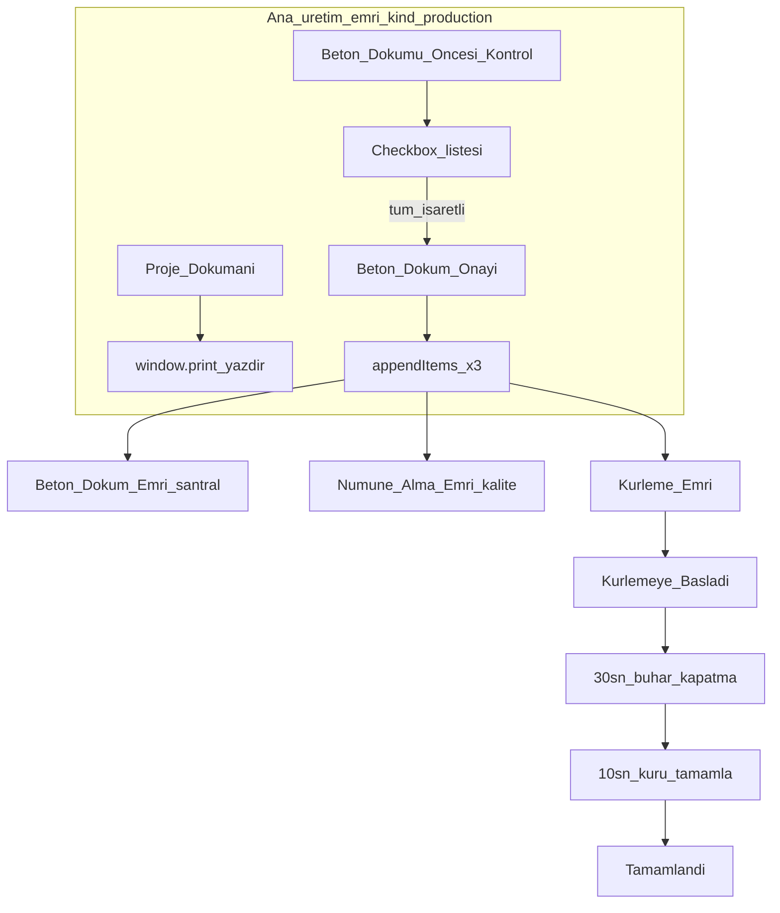

# Birim İş Kuyruğu — Üretim Emri Detay Akışı (Frontend Mock)

## Kapsam ve kısıtlar

### Frontend-only (zorunlu — backend yazılmayacak)

Bu özellik **yalnızca mevcut React/Vite frontend** içinde uygulanır. Aşağıdakilerin **hiçbiri** kapsamda değildir:

- REST/GraphQL API, route handler, controller, service katmanı
- Veritabanı şeması, migration, ORM modelleri
- Sunucu tarafı iş kuyruğu, cron, WebSocket, push altyapısı
- Gerçek bildirim servisi (mock: in-memory state + isteğe bağlı `notificationFeedItems` prepend)
- Kalıcı kayıt (localStorage bile plan dışı; tercih: sadece `WorkQueueProvider` bellek state)

**Yapılacaklar:** `WorkQueueContext` genişletmesi, `workQueueMock` / yeni mock modüller, UI bileşenleri, i18n, `window.print`, client-side `setTimeout` demo zamanlayıcıları.

- **State**: Tüm akış `React state` + mevcut mock/context; sayfa yenilenince sıfırlanabilir (`WorkQueueProvider` ile uyumlu).
- **Hangi kayıtlar**: `WorkQueueItem.kind === 'production'` olan tüm satırlar ([`workQueueMock.ts`](frontend/src/data/workQueueMock.ts) + planlamadan [`productionDailyWorkOrder.ts`](frontend/src/planlama/productionDailyWorkOrder.ts) ile eklenenler).
- **Alt iş emirleri** (`pour` / `sample` / `curing`): Ayrı `WorkQueueItem` satırları; `parentWorkQueueId` ile ana üretim emrine bağlı. Liste/detayda `productionFlowRole` ile ayrıştırılır.
- **Kürleme zamanları (demo)**: 6 sa → **30 sn**, 2 sa → **10 sn** ([`productionWorkOrderFlowConstants.ts`](frontend/src/data/productionWorkOrderFlowConstants.ts) içinde tek yerden).

---

## 1. Veri modeli ve state (mock)

**Dosya:** [`frontend/src/data/productionWorkOrderFlow.ts`](frontend/src/data/productionWorkOrderFlow.ts) (yeni)

- `PRE_POUR_CHECKS`: sabit kontrol maddeleri (id + i18n key).
- `ProductionWorkOrderFlowState` per ana emir: `checklist`, `pourApprovedAt`, `spawnedChildIds[]`.
- `CuringFlowState` per kürleme emri: `status` (`beklemede` | `kurleme_basladi` | `buhar_kapatma_bekleniyor` | `bekleme_suresi` | `tamamlandi`), `startedAt`, `steamOffDueAt`, `completeDueAt`.
- Saf fonksiyonlar: `allChecksComplete`, `canApprovePour`, `alreadyPourApproved`, `buildSpawnedWorkOrders(parent)`, `advanceCuringStatus`.

**Genişletme:** [`workQueueMock.ts`](frontend/src/data/workQueueMock.ts)

- `WorkQueueKind`’e: `pour_order` | `sample_order` | `curing_order` (veya mevcut `production`/`quality` + `productionFlowRole` — tercih: **ayrı kind** + `parentWorkQueueId` daha net filtre için).
- `WorkQueueItem` alanları: `parentWorkQueueId?`, `sourceProductionOrderNo?`, `shiftLabel?`, `moldId?`, `productCode?` (planlama `detailBody` parse veya üretimde set).
- `WorkQueueOrgUnit`: `batch_plant`, `curing` + [`WORK_QUEUE_ORG_SEQUENCE`](frontend/src/data/workQueueMock.ts) ve i18n (`unitWorkQueue.org.batch_plant`, `unitWorkQueue.org.curing`).

**Context:** [`WorkQueueContext.tsx`](frontend/src/context/WorkQueueContext.tsx)

- `flowState: Map` veya `Record<workQueueId, ProductionWorkOrderFlowState>`.
- `curingState: Record<workQueueId, CuringFlowState>`.
- Metodlar: `togglePrePourCheck`, `approvePourSpawn` (tek seferlik; mükerrer engel), `startCuring`, `acknowledgeSteamOff` (opsiyonel), `completeCuring`.
- `appendItems` mevcut; spawn üç satırı prepend eder.
- **Demo timer**: `useEffect` interval veya `setTimeout` zinciri; kürleme detay paneli mount’ta due zamanları kontrol eder.

Planlama köprüsü: [`productionDailyWorkOrder.ts`](frontend/src/planlama/productionDailyWorkOrder.ts) — `buildWorkQueueItemsFromPreview` çıktısına `productCode`, `moldName`, `shiftLabel`, `volumeM3` gibi alanları structured olarak ekle (döküman tab’ı için `detailBody` parse’a güvenmemek).

---

## 2. UI — ana üretim emri detayı

**Dosya:** [`frontend/src/components/workQueue/ProductionWorkOrderDetailPanel.tsx`](frontend/src/components/workQueue/ProductionWorkOrderDetailPanel.tsx) (yeni)

[`UnitWorkQueueModuleView.tsx`](frontend/src/components/workQueue/UnitWorkQueueModuleView.tsx) içinde `selected.kind === 'production' && !selected.parentWorkQueueId` ise generic özet/proje/geçmiş yerine bu panel render edilir.

**Sekmeler (sıra sabit):**

| Sıra | Tab | İçerik |
|------|-----|--------|
| 1 | Proje Dökümanı | Yazdırılabilir layout |
| 2 | Beton Dökümü Öncesi Kontrol | Checkbox + onay |
| 3 | Oluşan İş Emirleri | Onay sonrası 3 satır özeti + birime/role etiketi (disabled/empty öncesi) |

Mevcut [`splitTabPill`](frontend/src/components/shared/splitModuleStyles.ts) + `project-mgmt-glass-light` / `gl` glass modu korunur ([`UnitWorkQueueModuleView`](frontend/src/components/workQueue/UnitWorkQueueModuleView.tsx) zaten `useThemeMode` kullanıyor).

### Tab 1 — Proje Dökümanı

**Dosya:** [`ProductionProjectDocumentView.tsx`](frontend/src/components/workQueue/ProductionProjectDocumentView.tsx) (yeni)

- Bölümler: **Proje** (kod, ad), **Ürün** (kod, ad, kalıp, hacim, reçete), **Üretim emri** (no, vardiya, fabrika, plan günü), **Saha notları** (kısa teknik blok).
- Ekranda normal chrome; **`@media print`** ile toolbar/modal gizleme ([`productionProjectDocumentPrint.css`](frontend/src/components/workQueue/productionProjectDocumentPrint.css)).
- **Yazdır** butonu: `window.print()` (repoda henüz print yok; bu özellik için standart pattern).
- Mock PDF önizleme zorunlu değil; odak printable HTML.

### Tab 2 — Beton Dökümü Öncesi Kontrol

- Her madde: checkbox + tamamlandı/bekliyor görsel durumu (liste progress: “3/8”).
- **Beton Döküm Onayı**: `disabled` until all checked; onaylandıysa banner + buton disabled + eksik kontrol mesajı yok.
- Onay → context `approvePourSpawn` → toast + Tab 3 güncellenir.

### Tab 3 — Oluşan İş Emirleri

- Onay öncesi: açıklayıcı boş durum.
- Onay sonrası: 3 kart — santral / kalite / kürleme — `orderNo`, `assignee`, `targetUnit`, bağlı proje/ürün/ana emir no.

---

## 3. UI — alt iş emirleri detayı

**Dosya:** [`CuringWorkOrderDetailPanel.tsx`](frontend/src/components/workQueue/CuringWorkOrderDetailPanel.tsx) (yeni)

`selected.kind === 'curing_order'` (veya seçilen role göre):

| Kind | Panel |
|------|--------|
| `curing_order` | Kürleme akışı (durum şeridi + aksiyonlar) |
| `pour_order` | Özet + santral operasyon mock (basit checklist opsiyonel P1) |
| `sample_order` | Özet + kalite numune mock |

**Kürleme durum makinesi:**

1. `beklemede` → **Kürlemeye Başladım** (zaman damgası kaydı)
2. `kurleme_basladi` → geri sayım / “Buhar makinesini kapat” uyarısı (30 sn sonra)
3. `buhar_kapatma_bekleniyor` → kullanıcı “Buharı kapattım” (veya otomatik geçiş demo)
4. `bekleme_suresi` → 10 sn sonra **Kürü Tamamla** aktif
5. `tamamlandi` → salt okunur özet

Bildirim: [`dashboardMock.ts`](frontend/src/data/dashboardMock.ts) `notificationFeedItems`’a runtime prepend (mock) veya detay içi banner — **feed’e ekleme tercih edilir** (qual-10 pattern).

---

## 4. Liste ve filtre davranışı

- Ana üretim emirleri listede aynı kart; alt emirler `parentWorkQueueId` ile ilişkili — listede gösterim: isteğe bağlı alt başlık “↳ Beton döküm” veya org filtresi ile ayrı görünür.
- Org filtresine `batch_plant`, `curing` eklenir.
- Demo kullanıcı (`u-sen`): spawn edilen emirler ilgili assignee’lere atanır; perspektif **Bana atanan** / **Atadığım** ile test edilebilir (assignee mock id’ler [`mockUsers.ts`](frontend/src/data/mockUsers.ts) / santral operatör).

---

## 5. i18n

[`tr.ts`](frontend/src/i18n/locales/tr.ts) / [`en.ts`](frontend/src/i18n/locales/en.ts):

- Tab başlıkları, kontrol maddeleri, onay/banner metinleri, spawn kartları, kürleme durumları, yazdır butonu, mükerrer onay mesajı.

---

## 6. Test planı (manuel, frontend)

1. `kind: production` satır seç → 3 tab sırası doğru; glass tema bozulmuyor.
2. Proje dökümanı → Yazdır önizlemede sade layout, UI chrome yok.
3. Tüm checkbox’lar işaretlenmeden onay pasif; işaretleyince aktif.
4. Onay → 3 yeni iş listelenir; ikinci onay engelli + banner.
5. Kürleme emri → Başla → 30 sn sonra buhar uyarısı → 10 sn sonra Tamamla → tamamlandı.
6. Planlamadan günlük emir oluştur → aynı detay akışı structured alanlarla dolu.

---

## Dosya özeti

| Aksiyon | Dosya |
|---------|--------|
| Yeni | `productionWorkOrderFlow.ts`, `productionWorkOrderFlowConstants.ts` |
| Yeni | `ProductionWorkOrderDetailPanel.tsx`, `ProductionProjectDocumentView.tsx`, `productionProjectDocumentPrint.css`, `CuringWorkOrderDetailPanel.tsx`, `Pour/Sample` mini paneller (isteğe bağlı tek dosya) |
| Güncelle | `WorkQueueContext.tsx`, `workQueueMock.ts`, `UnitWorkQueueModuleView.tsx`, `productionDailyWorkOrder.ts`, i18n |
| Dokunulmaz | Backend, API routes, MES gerçek entegrasyonu (MES [`mesMock.ts`](frontend/src/data/mesMock.ts) sadece referans/opsiyonel link)
