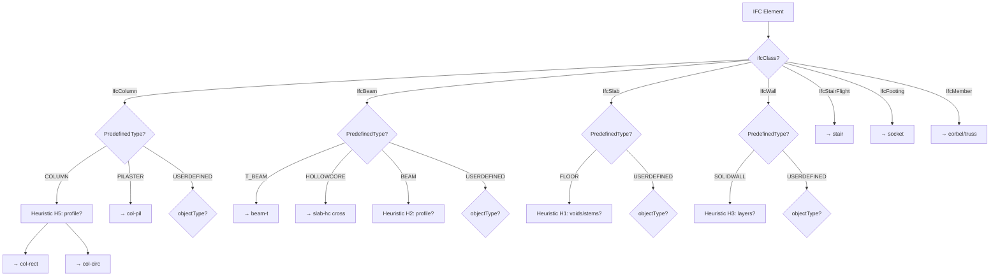

# 13 — IFC Import Mapping Matrisi (P0)

```
[Buraya 00-ORTAK-BLOK-ELEMENT-KIMLIK.md yapıştır]

GÖREV: IFC (ISO 16739) dosyalarından gelen eleman kayıtlarını sistemin ElementType/Typology
kataloğuna çevirecek mapping kurallarını belgele. CAD aracına (Tekla, Revit, Allplan, AutoCAD)
bağlı kalmadan, IFC entity + PredefinedType + geometrik heuristik bileşiminde karar veren
kural seti tanımlanacak.

GİRDİ KAYNAĞI (IFC'den gelen bilgi):
- ifcClass: IfcColumn | IfcBeam | IfcSlab | IfcWall | IfcStairFlight | IfcFooting | IfcMember | IfcPlate | IfcCovering
- ifcPredefinedType: enum değeri (örn. 'COLUMN', 'T_BEAM', 'SOLIDWALL', 'FLOOR')
- ifcObjectType: USERDEFINED durumunda string (örn. 'HollowCore', 'DoubleTee', 'YGirder')
- ifcName: CAD aracında verilen isim (orijinal; sourceName olarak saklanır)
- ifcGlobalId: 22-karakter GUID (sourceGuid)
- shapeRepresentation: geometrik bilgi (dimensionlar çıkarılır)
- propertySets: Pset_PrecastConcreteElementGeneral, Pset_PrecastSlab, vs.

ÇIKIŞ KAYDI (ProjectElement):
- elementTypeId, typologyId
- sourceSystem, sourceGuid, sourceName
- dimensions (shape representation'dan)
- attributes (property set'ten)

---

TEMEL MAPPING TABLOSU:

| # | IFC Class | PredefinedType | ObjectType (USERDEFINED için) | → ElementType | → Typology | Priority |
|---|-----------|----------------|--------------------------------|---------------|------------|----------|
| 1 | IfcColumn | COLUMN | — | col | col-rect (default) | 10 |
| 2 | IfcColumn | PILASTER | — | col | col-pil | 20 |
| 3 | IfcColumn | USERDEFINED | 'CircularColumn' | col | col-circ | 20 |
| 4 | IfcColumn | USERDEFINED | 'CorbelColumn' | col | col-crb | 20 |
| 5 | IfcColumn | USERDEFINED | 'ForkColumn' | col | col-frk | 20 |
| 6 | IfcColumn | USERDEFINED | 'TaperedColumn' | col | col-tpr | 20 |
| 7 | IfcBeam | BEAM | — | beam | beam-rect (default) | 10 |
| 8 | IfcBeam | T_BEAM | — | beam | beam-t | 20 |
| 9 | IfcBeam | EDGEBEAM | — | beam | beam-l | 20 |
| 10 | IfcBeam | SPANDREL | — | beam | beam-spd | 20 |
| 11 | IfcBeam | PIERCAP | — | beam | beam-cap | 20 |
| 12 | IfcBeam | LINTEL | — | beam | beam-lnt | 20 |
| 13 | IfcBeam | GIRDER_SEGMENT | — | beam | beam-ig | 20 |
| 14 | IfcBeam | HOLLOWCORE | — | slab | slab-hc | 30 (cross-mapping) |
| 15 | IfcBeam | USERDEFINED | 'InvertedTBeam' | beam | beam-it | 25 |
| 16 | IfcBeam | USERDEFINED | 'UBeam' | beam | beam-u | 25 |
| 17 | IfcBeam | USERDEFINED | 'BoxBeam' | beam | beam-box | 25 |
| 18 | IfcBeam | USERDEFINED | 'GutterBeam' | beam | beam-gtr | 25 |
| 19 | IfcBeam | USERDEFINED | 'YGirder' | beam | beam-y | 25 |
| 20 | IfcBeam | USERDEFINED | 'Purlin' | beam | beam-prl | 25 |
| 21 | IfcBeam | USERDEFINED | 'CraneBeam' | beam | beam-crn | 25 |
| 22 | IfcSlab | FLOOR | — | slab | slab-sol (default; heuristic ile refine) | 5 |
| 23 | IfcSlab | ROOF | — | slab | slab-rf | 20 |
| 24 | IfcSlab | LANDING | — | landing | landing-rect | 30 |
| 25 | IfcSlab | USERDEFINED | 'HollowCore' | slab | slab-hc | 30 |
| 26 | IfcSlab | USERDEFINED | 'DoubleTee' | slab | slab-dt | 30 |
| 27 | IfcSlab | USERDEFINED | 'SingleTee' | slab | slab-st | 30 |
| 28 | IfcSlab | USERDEFINED | 'Filigree' | slab | slab-fil | 30 |
| 29 | IfcSlab | USERDEFINED | 'RibbedSlab' | slab | slab-rib | 30 |
| 30 | IfcWall | SOLIDWALL | — | wall | wall-sol (default) | 10 |
| 31 | IfcWall | SHEAR | — | wall | wall-shr | 20 |
| 32 | IfcWall | PARTITIONING | — | wall | wall-prt | 20 |
| 33 | IfcWall | PARAPET | — | wall | wall-prp | 20 |
| 34 | IfcWall | RETAININGWALL | — | wall | wall-rtn | 20 |
| 35 | IfcWall | USERDEFINED | 'SandwichPanel' | wall | wall-swp | 25 |
| 36 | IfcWall | USERDEFINED | 'FacadePanel' | wall | wall-fac | 25 |
| 37 | IfcWall | USERDEFINED | 'GFRC' | wall | wall-gfr | 25 |
| 38 | IfcWall | USERDEFINED | 'LProfileWall' | wall | wall-l | 25 |
| 39 | IfcWall | USERDEFINED | 'UProfileWall' | wall | wall-u | 25 |
| 40 | IfcStairFlight | STRAIGHT | — | stair | stair-str | 20 |
| 41 | IfcStairFlight | WINDER | — | stair | stair-l | 20 |
| 42 | IfcStairFlight | HALF_TURN_STAIR | — | stair | stair-u | 20 |
| 43 | IfcStairFlight | SPIRAL_STAIR | — | stair | stair-spr | 20 |
| 44 | IfcMember | BRACE | — | corbel | corbel-rect (default) | 10 |
| 45 | IfcMember | USERDEFINED | 'TaperedCorbel' | corbel | corbel-tpr | 20 |
| 46 | IfcMember | USERDEFINED | 'RoofTruss' | truss | truss-flt (default) | 20 |
| 47 | IfcFooting | PAD_FOOTING | — | socket | socket-cup | 20 |

---

HEURİSTİK KURALLAR (PredefinedType yetersizse):

### H1: IfcSlab/FLOOR → slab-hc veya slab-dt veya slab-sol ayrımı
Girdi: shape representation (extrusion profile), property set.

```
if (hasInternalVoids(shape)) {
  // içeride çekirdekler var → Hollow Core
  count = voidCount(shape);
  return { typology: 'slab-hc', dimensions: { coreCount: count, ... } };
}
if (hasStemProfile(shape)) {
  // kesitin altında 2 veya 3 ayak → Double/Triple T
  stemCount = detectStemCount(shape);
  return { typology: stemCount === 1 ? 'slab-st' : 'slab-dt' };
}
if (thicknessVaries(shape)) {
  // üst kısım ince, alt kalın — Filigree olabilir
  return { typology: 'slab-fil' };
}
return { typology: 'slab-sol' };  // fallback
```

### H2: IfcBeam/BEAM → beam-rect mi beam-t mi?
Girdi: shape extrusion profile.

```
if (isTProfile(shape)) return 'beam-t';
if (isInvertedTProfile(shape)) return 'beam-it';
if (isLProfile(shape)) return 'beam-l';
if (isIProfile(shape)) return 'beam-i';
if (isUProfile(shape)) return 'beam-u';
if (isBoxProfile(shape)) return 'beam-box';
return 'beam-rect';  // fallback
```

### H3: IfcWall/SOLIDWALL → wall-sol mı wall-swp mi?
Girdi: property set, shape layer analizi.

```
if (pset.includes('InsulationLayer') || hasMultipleLayers(shape)) {
  return 'wall-swp';
}
return 'wall-sol';
```

### H4: IfcBeam/HOLLOWCORE → slab-hc (beam'den slab'e cross-mapping)
Direct: rule satırı 14. HOLLOWCORE IFC'de beam olarak modellenebilir ama sistemde döşeme.

### H5: IfcColumn/COLUMN → col-rect mi col-circ mi?
Girdi: shape profile.

```
if (isCircularProfile(shape)) return 'col-circ';
if (isSquareProfile(shape)) return 'col-sqr';
return 'col-rect';
```

---

PROPERTY SET MAPPING:

Pset_PrecastConcreteElementGeneral → attributes mapping:

| Pset Property | → attributes field | Tip |
|---------------|-------------------|-----|
| TypeDesignator | attributes.typeDesignator | string |
| CornerChamfer | attributes.cornerChamfer | number (mm) |
| ToleranceClass | attributes.toleranceClass | string |
| FormStrippingStrength | attributes.formStrippingStrength | number (MPa) |
| LiftingStrength | attributes.liftingStrength | number |
| ReleaseStrength | attributes.releaseStrength | number |
| TransportationStrength | attributes.transportationStrength | number |

Pset_PrecastConcreteElementFabrication → attributes:

| Pset Property | → ProjectElement field | Not |
|---------------|----------------------|-----|
| PieceMark | (info only; sistem kendi instance mark'ını üretir) | sourceName'e kopyala |
| SerialNumber | attributes.serialNumber | string |
| ProductionLotID | attributes.productionLotId | string |
| ActualProductionDate | attributes.actualProductionDate | ISO date |
| ActualErectionDate | attributes.actualErectionDate | ISO date |

Pset_PrecastSlab → attributes (SLAB için):

| Pset Property | → attributes |
|---------------|--------------|
| TypeDesignator | attributes.typeDesignator |
| ToppingType | attributes.toppingType |
| ComponentSpacing | attributes.componentSpacing |
| ComponentAngle | attributes.componentAngle |
| NominalThickness | (dimensions.thickness ile doğrula) |

---

MAPPING KARAR AĞACI (Mermaid):



---

FALLBACK / UNKNOWN DAVRANIŞI:

1. Hiçbir kural eşleşmezse → `elementTypeId=null`, `typologyId=null`, status='unmapped'.
2. Import wizard'ın Review adımında kullanıcıya gösterilir; manuel seçim istenir.
3. Kullanıcı seçtikten sonra → yeni IfcMappingRule öğretilebilir (firma-level custom rule).

---

PRIORITY ÇAKIŞMASI:

Aynı girdi (aynı IFC class + PredefinedType + ObjectType) için birden fazla kural eşleşirse:
- En yüksek priority kazanır.
- Eşit priority → ilk tanımlanan kazanır.
- Firma-level custom rule sistem kuralından her zaman öncelikli (firma önceliği).

---

BOYUT ÇIKARIMI (Dimension Extraction):

IFC shape representation'dan tanımlayıcı boyutları çıkarma:

| Typology | Kaynak | Formül |
|----------|--------|--------|
| col-rect | extrusion depth + section box | height=extrusionDepth, sectionW=boxW, sectionD=boxD |
| col-circ | extrusion + circle profile | height, diameter=2*radius |
| beam-t | extrusion + T profile | span=extrusionDepth, totalHeight, flangeWidth, webWidth, flangeThickness |
| slab-hc | extrusion + cored profile | length=extrusionDepth, width=profileWidth, thickness, coreCount, coreDiameter |
| slab-dt | extrusion + double-T profile | length, width, depth, flangeThickness, stemWidth, stemCount=2 |
| wall-sol | extrusion + rectangle profile | length, height, thickness |
| wall-swp | multi-layer extrusion | length, height, innerThickness, coreThickness, outerThickness |
| stair-str | stair body + step count | totalRun, totalRise, width, stepCount, treadDepth, riserHeight |

---

MOCK IFC SNIPPET + BEKLENEN EŞLEŞME:

### Örnek 1 — Dikdörtgen Kolon (Tekla'dan)
```
#1 = IFCCOLUMN('0LV8Qv4f1Ev8NR2WvGNLhA', #2, 'C-01-400x400',
     'Rectangular Column 400x400x5000', $, #3, #4, $, .COLUMN.);
Shape: ExtrudedAreaSolid; Profile: IfcRectangleProfileDef(xDim=400, yDim=400); depth=5000.
```

Beklenen:
```json
{
  "elementTypeId": "col",
  "typologyId": "col-rect",
  "sourceSystem": "TEKLA",
  "sourceGuid": "0LV8Qv4f1Ev8NR2WvGNLhA",
  "sourceName": "C-01-400x400",
  "dimensions": { "height": 5000, "sectionWidth": 400, "sectionDepth": 400 },
  "attributes": {}
}
```

### Örnek 2 — T Kiriş (Revit'ten)
```
#5 = IFCBEAM('2Fa...', ..., 'TB-12M-30x60', ..., .T_BEAM.);
Profile: IfcTShapeProfileDef(flangeWidth=600, webThickness=200, flangeThickness=150, depth=600); depth=12000.
```

Beklenen:
```json
{
  "elementTypeId": "beam",
  "typologyId": "beam-t",
  "sourceSystem": "REVIT",
  "sourceGuid": "2Fa...",
  "sourceName": "TB-12M-30x60",
  "dimensions": { "span": 12000, "totalHeight": 600, "flangeWidth": 600, "webWidth": 200, "flangeThickness": 150 }
}
```

### Örnek 3 — Hollow Core (Allplan'den, beam olarak modelli)
```
#9 = IFCBEAM('4Qx...', ..., 'HC-800-20', ..., .HOLLOWCORE.);
Profile: IfcArbitraryProfileDef with 6 circular voids; depth=8000, width=1200, thickness=200.
```

Beklenen:
```json
{
  "elementTypeId": "slab",
  "typologyId": "slab-hc",
  "sourceSystem": "ALLPLAN",
  "sourceGuid": "4Qx...",
  "sourceName": "HC-800-20",
  "dimensions": { "length": 8000, "width": 1200, "thickness": 200, "coreCount": 6, "coreDiameter": 140 }
}
```

---

İSTENEN ÇIKTI:
1. Mapping tablosu (47 satır, tam).
2. Heuristik kurallar H1-H5 (pseudocode).
3. Pset mapping tabloları (general + fabrication + slab).
4. Karar ağacı (Mermaid).
5. Fallback davranışı ve priority çakışma kuralları.
6. Boyut çıkarım formülleri.
7. 3 mock IFC snippet + beklenen ProjectElement kaydı.

P0:
- Mapping tablosu tam.
- Heuristikler H1-H5.
- Fallback + priority kuralları.
- 3 mock IFC senaryosu.

P1:
- Karar ağacı (Mermaid).
- Pset mapping tabloları.
- Boyut çıkarım formülleri.

P2:
- Custom firma kuralları (firm-level IfcMappingRule).
- Machine learning ile auto-heuristik önerisi (gelecek faz).
- IFC 4.3.2 dışı sürümler (IFC 2x3) için geriye uyumluluk.

AÇIK SORULAR:
1. Tekla ve Revit'in farklı ObjectType kullanma alışkanlıkları var. Tekla "HollowCore" yazar,
   Revit "Hollow_Core" yazabilir. ObjectType normalization gerekir mi?
2. Heuristik H1 (slab hollow detection) geometrik işlem gerektiriyor — MVP'de skip edip
   sadece PredefinedType + ObjectType'a bakmak yeterli mi? (Kullanıcı manuel düzeltir.)
3. IFC 2x3 desteklenecek mi yoksa sadece 4.3.2+? 2x3'te bazı predefined type'lar yok.
4. Aynı element iki farklı IFC dosyasından iki kez import edilirse (aynı GUID'li):
   skip / overwrite / revision++? Varsayılan davranış nedir?
5. Custom property set'lerde olmayan bilgiler (örn. donatı detayı) import sırasında nasıl
   yakalanır? Üçüncü parti property set'leri (örn. Tekla'nın 'Custom' pset'leri) gözardı mı
   edilir yoksa raw JSON olarak attributes altına saklanır mı?
```
